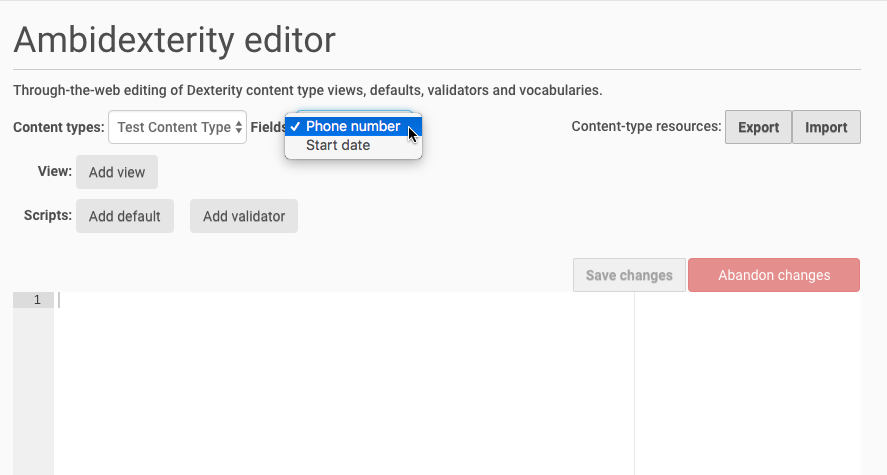
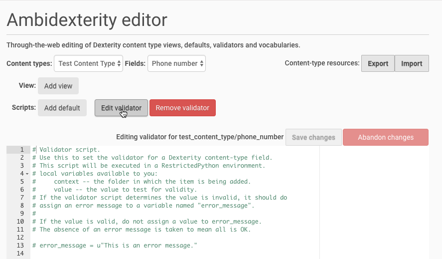
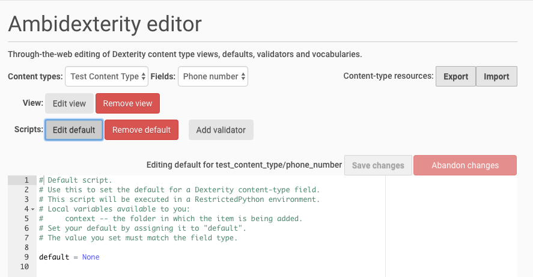
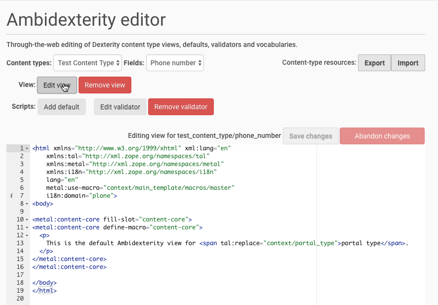

Tutorial
========

.. figure:: images/dexterity1.png
    :alt: Dexterity editor with sample field

    The Dexterity field editor showing our sample content type and its two test fields.

.. figure:: images/ambidexterity_editor.png
    :alt: The Ambidexterity editor.

    The Ambidexterity editor. Note that there is only one option for a built-in content type: to create a custom view.

.. figure:: images/ambidexterity_editor_dropdown.png
    :alt: The Ambidexterity editor: selecting a content type.

    The Ambidexterity editor: selecting a content type.

    The Ambidexterity editor: selecting a content type's field. Note that there are new options for our test content type since it was built TTW.

    Editing a validator.

    Editing a dynamic default.

.. figure:: images/default_traceback.png
    :alt: An error adding a simple content type.

    An error adding a content type with a bad default.

.. figure:: images/default_view.png
    :alt: Dexterity's default view.

    Dexterity's default view for our content type.

    Editing a view template.

.. figure:: images/updated_view.png
    :alt: Updated view.

    Our update view.

ZPT Reference: https://zope.readthedocs.io/en/latest/zope2book/AppendixC.html

Plone page templates reference: https://docs.plone.org/adapt-and-extend/theming/templates_css/template_basics.html

module security: https://github.com/collective/collective.localfunctions

RestrictedPython docs: http://restrictedpython.readthedocs.io/en/latest/

modules
math
random
string

datetime
re

globals
context
value
error_message
vocabulary

Create a sample Dexterity content type

Setting a dynamic default
    Note on RestrictedPython
    Error handling

Validating a field
    Validating a string field - ^\+(?:[0-9] ?){6,14}[0-9]$
    Validating a date field

Creating a view template
    Note on zpt

Adding a vocabulary
    Valid vocabulary types

Traceback::

    2017-10-09 14:35:38 ERROR Zope.SiteErrorLog 1507584938.270.45842617267 http://lumpy:8080/Plone/++add++test_content_type
    Traceback (innermost last):
      Module ZPublisher.Publish, line 138, in publish
      Module ZPublisher.mapply, line 77, in mapply
      Module ZPublisher.Publish, line 48, in call_object
      Module plone.z3cform.layout, line 66, in __call__
      Module plone.z3cform.layout, line 50, in update
      Module plone.dexterity.browser.add, line 130, in update
      Module plone.z3cform.fieldsets.extensible, line 59, in update
      Module plone.z3cform.patch, line 30, in GroupForm_update
      Module z3c.form.group, line 132, in update
      Module z3c.form.form, line 136, in updateWidgets
      Module z3c.form.field, line 277, in update
      Module Products.CMFPlone.patches.z3c_form, line 46, in _wrapped
      Module z3c.form.widget, line 115, in update
      Module zope.schema._bootstrapfields, line 78, in __get__
      Module zope.schema._bootstrapfields, line 183, in validate
      Module zope.schema._field, line 236, in _validate
      Module zope.schema._bootstrapfields, line 287, in _validate
      Module zope.schema._bootstrapfields, line 210, in _validate
    WrongType: (u'Tuesday', <type 'datetime.date'>, 'start_date')
